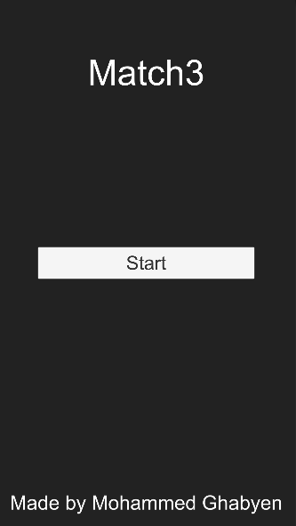
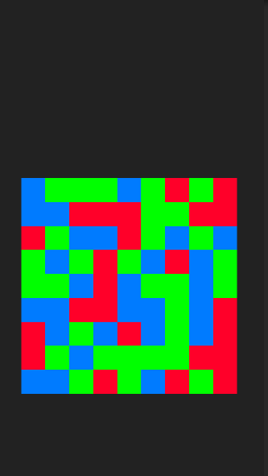
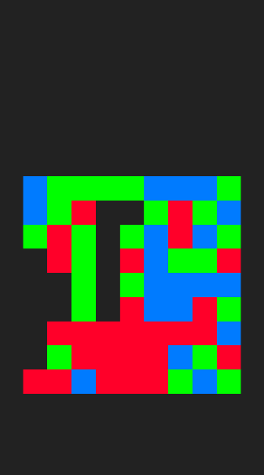

# Match3
* This is a sample unity project, match 3 algorithm for colored squares.

# How it works
* User click on any of the square, the algorithm check the upper, lower, right and left squares colors, if there is a match, it continue 
checking with same squares colors etc.

### Photos of The Game

   

